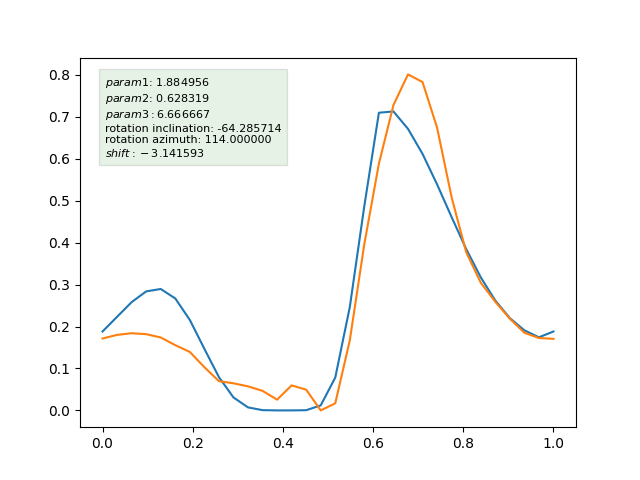
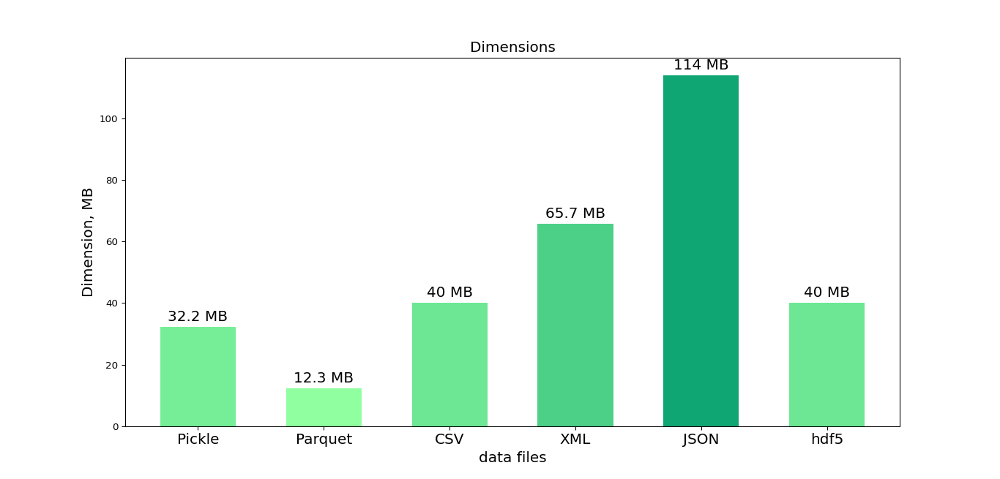

# Database x-ray pulsars

This project defines the parameters of the x-ray pulsar and generates the expected pulse profile starting from these parameters. The simulated results are then stored in a file for later usage. The files to read and compare the data are also part of the project.

# Tables of contents
- The physics
- Files in the project
- Prerequisites
- How to run the project
- Usage
- Data in the database

# The physics
The project is based on the physics and the simulation described in the PhD thesis: https://publikationen.uni-tuebingen.de/xmlui/handle/10900/144225, Saathoff, 2023

### What are the accreting X-ray pulsars
Accreting X-ray pulsars represent a distinctive class of binary stars. 
They comprise a neutron star, which is the smaller and more compact of the two stellar components, and a companion or 'donor' star. 
The donor star supplies matter to the denser neutron star. 
However, the neutron star is surrounded by a robust magnetosphere, which deflects and guides the matter along the field lines, and reaches the surface at the poles. 
Upon reaching the surface, a considerable amount of energy is released in the form of X-rays. 
This process can be compared to the phenomenon of the northern lights, which shine in our skies on Earth, but it is incredibly distruptive.

### How do we observe them and which parameters do we need
X-ray pulsars are some of the brightest X-ray sources in the sky.
The intense X-ray emission from them is observed as pulsations,which gives them their name. 
These pulsations are caused by the rotation of the neutron star
and the misalignment between the spin axis and the magnetic axis of the neutron star. 

The shape of the pulsations is known as the pulse profile, which can vary with energy, luminosity, orbital phase and other parameters. 

The aim of this project is to vary some of these parameters
(namely: the rotation axis angles, three parameters describing the beam pattern, the phase shift and the magnetic colatitude).
These variations will then be used to simulate the observed hotspot pattern.

### The hotspot and the beam pattern
The term "hotspot" refers to the point at which X-rays are emitted. For the purposes of this project, a single hotspot is considered. In order to locate it, we consider a single emitting hotspot located around the rotation axis. The position of this hotspot is described by the magnetic colatitude and the phase shift. These parameters are used to define the intrinsic angles of the hotspot on the surface of the star. The intrinsic angles univocally locate the hotspot on the star.

The X-ray beam can be emitted from the hotspot in a number of different ways:

The beam can be emitted in a "pencil" beam configuration, 
where the beam is emitted along the normal direction to the surface.

Alternatively, it can be emitted in a "fan" beam configuration, where the emission is 
perpendicular to the normal direction to the surface. 

Finally, it can be emitted in a mixed configuration, 
where the emission is more complicated and can happen in different directions. 

The beam pattern will be studied in the project, with the aim of parametrizing a function describing the 
emission with two angles. These angles will describe an inclination and an "azimuth" angle with respect to the 
normal to the surface where the hotspot is emitting from.

Additionally, a parameter is defined that describes the "peakiness" of the observed pulse profile, namely the power of the beam emitted.

A visual description of how the angles are defined is given:

# Files in the project
**!!IMPORTANT!!**

be careful to change/adapt the file path when using the files, in order to save and read the database in a correct folder of your choice.

- **PulsarPool.py**: This generates data of a given length utilising ProcessPoolExecutor, which parallelises the processes. It then saves the data in a Parquet file. 
It also defines the ranges of the parameters and the resolution. The process of saving the data starts with saving the datasets
in different parquet files in the same specified folder, and then there is a function which merges all the files in one big file containing all the database

- **PulsarListComprehension.py**: generates the data of a given length utilizing for cycles through list comprehension. This is alternative process to the PulsarPool.py one. This also saves the data in a Parquet file.

- **ReadParquet.py**: defines the functions needed to read the Parquet file.

- **Compare.py**: reads the file where the simulated data are stored and defines the functions in order to compare them with an experimental example.

- **main.py**: does all the things at once. The program creates datasets, saves them, reads them back, and compares them with experimental data. It does this with list comprehension, so it is useful to try the whole project at once, but it is not the most efficient way to save and generate the data.

- **GetPulseProfileFromInput.py**: another example of how to use the data. It takes as input the seven parameters from the user and finds the pulse profile corresponding to the simulated data that is closest to the input ones.
  

- **Pulsar_Notebook.ipynb**: This is a notebook equivalent to the main one that explains the process in detail, thus facilitating a better understanding.

- **Database folder**:
  - **Database_100000.parquet**: This is the actual database containing the data simulated. It has been created with 100,000     simulated datasets and is ready to be used, for example, with ReadParquet and Compare. Useful to run the codes fast, to understand how they work, since it has a relatively small size compared to the final one.

  - **LinkFullDatabase.md**: link to the full created database with more than 25 milion datasets created. Use this for research.

# Prerequisites
In order to run properly all parts of the project, the following packages should be installed on your Python interpreter:
- numpy
- concurrent.futures 
- pandas
- matplotlib.pyplot
- tqdm (this is just the progress bar) 
- scipy.interpolate
- os
- time
- pyarrow
- functools

# How to run the project
It is good to read and run the Jupyter Notebook first, in order to get a better idea of what the project does. Then one can simply download the project folder and use the files with your interpreter. 

**!!IMPORTANT!!**

be careful to change/adapt the file path when using the files, in order to save and read the database in a correct folder of your choice.

# Usage
The two ways this project is intended to be used are:
1. Simulate new data starting from the file defining the simulations.

2. Read and use the database created in order to use it, ideally to train a machine learning to get the parameters of an accreting X-ray pulsar based on the pulse profile

# Data in the database

The data in the database are saved in the parquet format and can be easily read by the ReadParquet function provided. This returns a list of dictionaries each containing 7 different float parameters and the pulse profile (array of 32 entries). 

The choice of using a list of dictionaries was made foreseeing an usage in machine learning, where labelling the data in an efficient way is fundamental. 

One example of dictionary in the list is the following:

{'param1': 0.0, 

'param2': -3.141592653589793, 

'param3': 6.666666666666667, 

'hotspot pattern': array([ 32 entries]),

'rotation inclination': 60.0,

'rotation azimuth': -67.5,

'magnetic colatitude': 60.0,

'shift': -3.141592653589793}

## Example of usage
The example of usage explains how to use the data produced. I fitted an experimental dataset from Cen X−3 PCVA with the simulated data. The image shows the comparison between experimental data and the best simulated fit (only 100 000 occurences taken into account).

## Choice of the file type

The file type (parquet) was selected following an analysis of the performance of different file types in terms of three key areas:

- Time efficiency
- Storage dimension
- Usability (how easy is it to read and write)

The dataset used for these comparisons was of 78,125 occurrences, which is relatively small compared to the final dataset. However, it was sufficient to enable meaningful comparisons between the files.
The data are composed of seven float parameters and one array.

The fact that a list is one of the data types makes it more challenging to implement a CSV-type file, as it is not straightforward to write (and particularly to read back) a list as comma-separated single values.

Conversely, our dataset is conceptually rather simple, so there is no need for a more complex dataset that could offer enhanced query efficiency (such as HDF5). The objective comparison of the performance of the various data formats and the fact that Parquet can be read by other operating systems (and not only by Python) led to the decision to use Parquet. 
The following images compare the performances of the cited file types:

